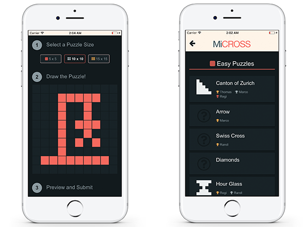

# Micross Web

[Micross Web](https://micross.tresch.me) is a single page web application based on *Angular*. While it's entirely possible to run Micross Web standalone, additional functionality is available once it is embedded within a native mobile application wrapper.

The Micross native application (which is built on top of Micross Web) is available both for [iOS](https://goo.gl/iCLIM1) and [Android](https://goo.gl/nIjbD4):

The project was intially generated with [angular-cli](https://github.com/angular/angular-cli) version 1.0.0-beta.26.

## Development

### Code Scaffolding
Run `ng generate component <component-name>` to generate a new component. You can also use `ng generate directive/pipe/service/class/module`.

### Development Server
Run `ng serve` for a dev server. Navigate to `http://localhost:4200/`. The app will automatically reload if you change any of the source files.

### Icon Fonts
To optimize the downloaded file size, we have chosen to strip down FontAwesome with [IcoMoon](https://icomoon.io/app/). The respective icon subset is available in `etc/icomoon-selection.json`. It can be imported online to maintain the icon set.

### IDE Setup

#### IntelliJ Run Configurations and Debugging
IntelliJ can be used to conveniently run and debug the application. In order to do so, two separate run configurations have to be setup

* `ng serve`

	Runs the start script defined in `package.json` and hence serves the app (using hot reload) through `ng serve`: Simply add a run configuration of type *npm*, use the *run* command and select the *start* script from the dropdown.

* `debug`

	Allows debugging from within the IDE (note: the IntelliJ extension has to be installed in Chrome as a prerequisite): Add a run configuration of type *JavaScript Debug*, and point to the URL at which the app is running (`http://localhost:4200` by default)

## Build

Run `ng build` to build the project. The build artifacts will be stored in the `dist/` directory. See **Releasing** for information on production builds.

## Automated Tests

### Unit Tests

#### From the Terminal

Run `ng test` to execute the unit tests via [Karma](https://karma-runner.github.io).

You can visualize the test coverage by issuing (coverage report will be made available in `coverage` subfolder):

    ng test --code-coverage

#### From within IntelliJ

A Karma `run configuration` can be configured (install the *Karma* plugin).
When selected, the tests can be run using `SHIFT` `F10`.

### End-to-end Tests

Run `ng e2e` to execute the end-to-end tests via [Protractor](http://www.protractortest.org/).
Before running the tests make sure you are serving the app via `ng serve`.

## Releasing

*Note: The project has been initially setup using `firebase init` to be deployed directly to Firebase. You'll want to check the [Firebase Developer Console](https://console.firebase.google.com) for additional information.*

### Environments

Currently, two environments exist for deployment:

* Production: `prod (micross-955d7)`
* Development: `default (micross-dev)`

You can switch between environments with the command `firebase use`. By default, you'll deploy to the Development environent.

### Deployment

* Choose the appropriate environment
  
* Build the project (to `./dist` subfolder) with additional production optimizations such as bundling and minification enabled:

		ng build --prod --aot

* Deploy to Firebase by running:

		firebase deploy

## Further help

To get more help on the `angular-cli` use `ng help` or go check out the [Angular-CLI README](https://github.com/angular/angular-cli/blob/master/README.md).
